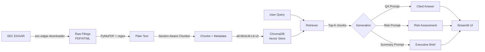

# DueDiligenceAI

**AI-powered due diligence — from SEC filings to risk insights in seconds.**

An open-source RAG (Retrieval-Augmented Generation) platform that ingests SEC EDGAR filings (10-K, 10-Q), builds a vector store, and provides source-cited answers, automated risk assessments, and executive summaries for publicly traded companies.

---

## Features

- **RAG over SEC Filings** — Ingest 10-K/10-Q filings for any public company via SEC EDGAR
- **Source-Cited Q&A** — Ask questions, get answers grounded in actual filing text with citations
- **Risk Assessment** — Automated red/amber/green flag extraction across financial, legal, operational, market, and regulatory categories
- **Executive Summary** — One-click due diligence brief with financials, risks, opportunities, and recommendation
- **Confidence Scoring** — Every answer comes with a retrieval confidence score
- **Section-Aware Chunking** — Intelligently splits filings by SEC sections (Risk Factors, MD&A, Financial Statements, etc.)
- **FastAPI Backend** — REST API for programmatic access
- **Configurable LLM** — Works with Ollama (local) or HuggingFace Inference API (cloud)
- **Evaluation Pipeline** — Built-in benchmarking with keyword recall, source coverage, and confidence metrics
- **Docker Ready** — One-command deployment with docker-compose

## Architecture



---

## Quick Start (Full Setup Guide)

### Prerequisites

- **Python 3.11+** (`python3 --version`)
- **pip** (`pip --version`)
- **Git** (`git --version`)
- **Ollama** (for local LLM) — [install from ollama.com](https://ollama.com) — OR a HuggingFace account for cloud inference

### 1. Clone and install

```bash
git clone https://github.com/axe-hat/due-diligence-ai.git
cd due-diligence-ai
```

Create a virtual environment and install dependencies:

```bash
python -m venv .venv
source .venv/bin/activate          # Linux/Mac
# .venv\Scripts\activate           # Windows

pip install -r requirements.txt
```

**requirements.txt installs:**
| Package | Purpose |
|---------|---------|
| `chromadb>=0.5.0` | Vector store (persistent, cosine similarity) |
| `sentence-transformers>=3.0.0` | Embedding model (`all-MiniLM-L6-v2`, 384-dim) |
| `fastapi>=0.115.0` | REST API framework |
| `uvicorn>=0.30.0` | ASGI server for FastAPI |
| `streamlit>=1.38.0` | Frontend UI |
| `PyMuPDF>=1.24.0` | PDF text extraction |
| `sec-edgar-downloader>=5.0.0` | SEC EDGAR filing downloader |
| `requests>=2.32.0` | HTTP client |
| `python-dotenv>=1.0.0` | Environment variable loading from `.env` |
| `pytest>=8.0.0` | Test framework |
| `huggingface-hub>=0.24.0` | HuggingFace Inference API client |

### 2. Configure environment

```bash
cp .env.example .env
```

Edit `.env` with your preferred settings:

```bash
# === LLM Backend ===
# Option A: Ollama (local, default) — requires Ollama running locally
LLM_BACKEND=ollama
LLM_MODEL=gemma2:9b               # Any Ollama model: llama3, mistral, phi3, etc.
OLLAMA_URL=http://localhost:11434

# Option B: HuggingFace Inference API (cloud, free tier)
# LLM_BACKEND=hf
# HF_MODEL=mistralai/Mistral-7B-Instruct-v0.3
# HF_API_TOKEN=hf_xxxxx           # Optional for public models, required for gated

# === Embedding ===
EMBEDDING_MODEL=all-MiniLM-L6-v2   # ~80MB, CPU-safe, 384-dim vectors

# === ChromaDB ===
CHROMA_PATH=./data/vectorstore     # Where vectors are stored persistently

# === SEC EDGAR (required for downloading filings) ===
# SEC requires a user-agent with name + email for API access
SEC_AGENT_NAME=Your Name
SEC_AGENT_EMAIL=your.email@example.com
```

**If using Ollama**, make sure it's running and has a model pulled:

```bash
ollama serve                        # Start Ollama (if not running)
ollama pull gemma2:9b               # Pull the default model (~5.4GB)
# Other good options: llama3, mistral, phi3
```

**If using HuggingFace**, set `LLM_BACKEND=hf` in `.env`. Free tier works with public models like Mistral-7B.

### 3. Download and ingest SEC filings (data pipeline)

Run these three scripts in order. Each script builds on the previous one's output:

```bash
# Step 1: Download 10-K filings from SEC EDGAR (8 companies, ~2-5 min)
python scripts/01_download_filings.py

# Step 2: Parse PDFs/HTML and chunk into sections (~30 sec)
python scripts/02_parse_and_chunk.py

# Step 3: Build ChromaDB vector store with embeddings (~1-3 min)
# NOTE: First run downloads the embedding model (~80MB)
CUDA_VISIBLE_DEVICES="" python scripts/03_build_vectorstore.py
```

**What each script does:**

| Script | Input | Output | Time |
|--------|-------|--------|------|
| `01_download_filings.py` | SEC EDGAR API | `data/raw/` — PDF/HTML filings | 2-5 min |
| `02_parse_and_chunk.py` | `data/raw/` | `data/processed/` — JSON chunks with metadata | ~30 sec |
| `03_build_vectorstore.py` | `data/processed/` | `data/vectorstore/` — ChromaDB with embeddings | 1-3 min |

**Default companies:** AAPL, TSLA, GOOGL, MSFT, NVDA, AMZN, META, JPM (configurable in `scripts/01_download_filings.py`)

**Tip:** Use `CUDA_VISIBLE_DEVICES=""` to force CPU embedding if you have GPU memory constraints.

### 4. Launch the Streamlit UI

```bash
streamlit run ui/app.py
# Opens at http://localhost:8501
```

The UI has 3 tabs:
- **Q&A** — Ask questions about any company, get cited answers with confidence scores
- **Executive Summary** — One-click due diligence brief for any indexed company
- **Risk Assessment** — Red/amber/green flag analysis across 5 risk categories

### 5. Or use the REST API

```bash
uvicorn src.api.server:app --reload --port 8000
# API docs: http://localhost:8000/docs (Swagger UI)
# ReDoc: http://localhost:8000/redoc
```

### 6. Run the demo script

```bash
python scripts/05_demo.py
# Runs all 3 generation modes (Q&A, Risk, Summary) on the first available company
```

### 7. Run the evaluation pipeline

```bash
python scripts/04_run_eval.py
# Evaluates 10 curated questions across 8 companies
# Saves report to data/eval_report.json
```

---

## API Reference

Base URL: `http://localhost:8000`

### `GET /api/health`

Health check — returns status and chunk count.

```bash
curl http://localhost:8000/api/health
```

Response:
```json
{"status": "healthy", "chunks_indexed": 323}
```

### `GET /api/companies`

List all indexed companies.

```bash
curl http://localhost:8000/api/companies
```

Response:
```json
{"companies": ["AAPL", "AMZN", "GOOGL", "JPM", "META", "MSFT", "NVDA", "TSLA"], "count": 8}
```

### `POST /api/query`

Ask a question with source-cited answer. Optionally filter by company or filing type.

```bash
curl -X POST http://localhost:8000/api/query \
  -H "Content-Type: application/json" \
  -d '{"question": "What are Apple'\''s top risk factors?", "company": "AAPL"}'
```

Request body:
```json
{
  "question": "What are the main risk factors?",
  "company": "AAPL",           // optional — filter to specific company
  "filing_type": "10-K"        // optional — filter to specific filing type
}
```

Response:
```json
{
  "answer": "Based on the 10-K filing, Apple's key risk factors include...",
  "confidence": 0.87,
  "sources": [
    {"text": "...", "company": "AAPL", "section": "Risk Factors", "score": 0.92}
  ]
}
```

### `POST /api/risk-assessment/{company}`

Generate risk assessment with red/amber/green flags.

```bash
curl -X POST http://localhost:8000/api/risk-assessment/AAPL
```

Response:
```json
{
  "company": "AAPL",
  "assessment": "...",
  "chunks_analyzed": 8
}
```

### `POST /api/executive-summary/{company}`

Generate a one-page due diligence brief.

```bash
curl -X POST http://localhost:8000/api/executive-summary/TSLA
```

Response:
```json
{
  "company": "TSLA",
  "summary": "...",
  "chunks_analyzed": 8
}
```

### `POST /api/search`

Semantic search without LLM generation (retrieval only).

```bash
curl -X POST http://localhost:8000/api/search \
  -H "Content-Type: application/json" \
  -d '{"question": "revenue growth"}'
```

Response:
```json
{
  "query": "revenue growth",
  "results": [{"text": "...", "company": "AAPL", "score": 0.89}],
  "count": 8
}
```

---

## Docker Deployment

```bash
cd docker
docker-compose up --build
# Streamlit UI: http://localhost:8501
# FastAPI API:  http://localhost:8000/docs
# Ollama:       http://localhost:11434 (in-container)
```

The `docker-compose.yml` runs two services:
- **app** — FastAPI + Streamlit (ports 8000, 8501)
- **ollama** — Ollama LLM server (port 11434)

To use a different model inside Docker, exec into the container:
```bash
docker exec -it docker-ollama-1 ollama pull llama3
```

---

## Running Tests

```bash
# From project root, with venv activated:
PYTHONPATH=. pytest tests/ -v

# Or using pyproject.toml config:
pytest tests/ -v
```

**Test modules:**

| File | Tests | What it covers |
|------|-------|----------------|
| `tests/test_ingestion.py` | 5 | PDF parsing, HTML stripping, chunking, section detection, metadata |
| `tests/test_retrieval.py` | 2 | Semantic search, company filtering |
| `tests/test_generation.py` | 5 | QA chain, risk assessor, executive summary, LLM abstraction |
| `tests/test_api.py` | 3 | FastAPI endpoints (health, companies, search) |

**15 tests total** — all pass without requiring an LLM or vectorstore.

CI runs automatically on push via `.github/workflows/ci.yml`.

---

## Tech Stack

| Component | Technology |
|-----------|------------|
| Vector Store | ChromaDB (persistent, cosine similarity) |
| Embeddings | sentence-transformers (`all-MiniLM-L6-v2`, 384-dim) |
| LLM | Ollama (local) / HuggingFace Inference API |
| Data Source | SEC EDGAR (10-K, 10-Q filings) |
| API | FastAPI + Uvicorn |
| Frontend | Streamlit |
| Testing | pytest |
| CI/CD | GitHub Actions |
| Containerization | Docker + docker-compose |
| Language | Python 3.11+ |

---

## Project Structure

```
due-diligence-ai/
├── src/
│   ├── __init__.py
│   ├── config.py                 # All configuration (env vars, paths, model settings)
│   ├── ingestion/
│   │   ├── __init__.py
│   │   ├── sec_downloader.py     # Download 10-K/10-Q from SEC EDGAR
│   │   ├── pdf_parser.py         # Extract text from PDF (PyMuPDF) and HTML filings
│   │   └── chunker.py            # Section-aware chunking with 12 SEC headers + overlap
│   ├── vectorstore/
│   │   ├── __init__.py
│   │   └── chroma_store.py       # ChromaDB: create collection, batch add, stats, reset
│   ├── retrieval/
│   │   ├── __init__.py
│   │   └── retriever.py          # Cosine similarity search + company/filing_type filters
│   ├── generation/
│   │   ├── __init__.py
│   │   ├── llm.py                # LLM abstraction (Ollama + HuggingFace backends)
│   │   ├── qa_chain.py           # Q&A with source citations + confidence scoring
│   │   ├── risk_assessor.py      # Multi-query risk analysis (5 categories)
│   │   └── executive_summary.py  # Structured due diligence brief generation
│   ├── evaluation/
│   │   ├── __init__.py
│   │   ├── eval_dataset.py       # 10 curated Q&A pairs across 8 companies
│   │   └── metrics.py            # Keyword recall, source coverage, confidence metrics
│   └── api/
│       ├── __init__.py
│       └── server.py             # FastAPI app with 6 REST endpoints
├── ui/
│   └── app.py                    # Streamlit frontend (3 tabs: QA, Summary, Risk)
├── scripts/
│   ├── 01_download_filings.py    # Download SEC filings
│   ├── 02_parse_and_chunk.py     # Parse and chunk documents
│   ├── 03_build_vectorstore.py   # Build ChromaDB vector store
│   ├── 04_run_eval.py            # Run evaluation pipeline
│   └── 05_demo.py                # Quick demo (runs all 3 generation modes)
├── data/
│   ├── sample/                   # Sample chunks for quick testing (tracked in git)
│   │   ├── sample_chunks.json    # 5 AAPL chunks for demo
│   │   └── README.md
│   ├── raw/                      # Downloaded SEC filings (gitignored)
│   ├── processed/                # Chunked JSON files (gitignored)
│   └── vectorstore/              # ChromaDB persistent store (gitignored)
├── tests/
│   ├── __init__.py
│   ├── conftest.py               # Path setup for imports
│   ├── test_ingestion.py         # Ingestion tests (5)
│   ├── test_retrieval.py         # Retrieval tests (2)
│   ├── test_generation.py        # Generation tests (5)
│   └── test_api.py               # API endpoint tests (3)
├── docker/
│   ├── Dockerfile
│   └── docker-compose.yml
├── docs/
│   └── architecture.md           # Architecture details + mermaid diagrams
├── .github/
│   └── workflows/
│       └── ci.yml                # CI: Python 3.11 + pytest on push/PR
├── .env.example                  # Template for environment configuration
├── .gitignore                    # Excludes raw data, vectorstore, .venv, __pycache__
├── requirements.txt              # Python dependencies
├── pyproject.toml                # Build config + pytest settings
├── CONTRIBUTING.md               # Contribution guidelines
├── LICENSE                       # MIT License
└── README.md                     # This file
```

---

## How It Works

1. **Download** — `sec-edgar-downloader` fetches 10-K filings from SEC EDGAR for 8 companies (AAPL, TSLA, GOOGL, MSFT, NVDA, AMZN, META, JPM). SEC requires a user-agent string (name + email) for API access.

2. **Parse** — PyMuPDF extracts text from PDFs; regex strips HTML tags from .htm filings. Both formats are common in SEC EDGAR.

3. **Chunk** — Section-aware splitter uses 12 SEC section headers to create semantically meaningful chunks:
   - Risk Factors, MD&A, Financial Statements, Business Overview, Legal Proceedings
   - Market Risk, Controls & Procedures, Properties, Executive Compensation
   - Selected Financial Data, Notes to Financial Statements, Auditor Report
   - Each chunk includes metadata: company ticker, filing type, section name, filing date
   - Configurable chunk size (default: 1000 chars) with overlap (default: 100 chars)

4. **Embed** — `all-MiniLM-L6-v2` (384-dim, ~80MB) encodes chunks into dense vectors. Runs on CPU by default.

5. **Store** — ChromaDB persistent client stores vectors + metadata. Supports batch operations and collection management.

6. **Retrieve** — Cosine similarity search with optional metadata filters (company, filing type). Returns top-K chunks (default K=8) with relevance scores.

7. **Generate** — Retrieved context is passed to an LLM with structured prompts:
   - **QA Chain** — Answers questions with inline citations referencing source chunks
   - **Risk Assessor** — Queries 5 risk categories (financial, legal, operational, market, regulatory), extracts red/amber/green flags
   - **Executive Summary** — Generates a structured brief: company overview, financial highlights, key risks, opportunities, and investment recommendation

---

## Configuration Reference

All configuration is in `src/config.py` and can be overridden via environment variables (`.env` file):

| Variable | Default | Description |
|----------|---------|-------------|
| `LLM_BACKEND` | `ollama` | LLM backend: `ollama` or `hf` |
| `LLM_MODEL` | `gemma2:9b` | Ollama model name |
| `OLLAMA_URL` | `http://localhost:11434` | Ollama API URL |
| `HF_MODEL` | `mistralai/Mistral-7B-Instruct-v0.3` | HuggingFace model ID |
| `HF_API_TOKEN` | _(empty)_ | HuggingFace API token (optional for public models) |
| `EMBEDDING_MODEL` | `all-MiniLM-L6-v2` | Sentence-transformers model name |
| `CHROMA_PATH` | `./data/vectorstore` | ChromaDB storage directory |
| `SEC_AGENT_NAME` | `DueDiligenceAI Bot` | SEC EDGAR user-agent name |
| `SEC_AGENT_EMAIL` | `duediligenceai@proton.me` | SEC EDGAR user-agent email |

**Hard-coded retrieval params** (in `src/config.py`):
- `TOP_K = 8` — Number of chunks retrieved per query
- `CHUNK_SIZE = 1000` — Characters per chunk
- `CHUNK_OVERLAP = 100` — Overlap between adjacent chunks

---

## Troubleshooting

### `ModuleNotFoundError: No module named 'src'`
Run from project root with `PYTHONPATH=.`:
```bash
PYTHONPATH=. python scripts/01_download_filings.py
# Or for pytest:
PYTHONPATH=. pytest tests/ -v
```

### Ollama connection refused
Make sure Ollama is running:
```bash
ollama serve    # Start the server
ollama list     # Check available models
ollama pull gemma2:9b  # Pull a model if needed
```

### Embedding model download slow / fails
The first run downloads `all-MiniLM-L6-v2` (~80MB). If it fails:
```bash
pip install sentence-transformers --upgrade
python -c "from sentence_transformers import SentenceTransformer; SentenceTransformer('all-MiniLM-L6-v2')"
```

### ChromaDB errors
If the vectorstore gets corrupted, delete and rebuild:
```bash
rm -rf data/vectorstore/
python scripts/03_build_vectorstore.py
```

### GPU out of memory
Force CPU-only embedding:
```bash
CUDA_VISIBLE_DEVICES="" python scripts/03_build_vectorstore.py
```

### SEC EDGAR rate limiting
SEC EDGAR has a 10 requests/second limit. The downloader handles this automatically, but if you hit issues, wait a few minutes and retry.

### Tests fail on import
Make sure you have `tests/__init__.py` and `tests/conftest.py` (both included in this repo). Run with:
```bash
PYTHONPATH=. pytest tests/ -v
```

---

## Evaluation Metrics

The evaluation pipeline (`scripts/04_run_eval.py`) measures:

| Metric | Description |
|--------|-------------|
| **Keyword Recall** | % of expected keywords found in the generated answer |
| **Source Coverage** | % of retrieved chunks that are relevant to the question |
| **Confidence Score** | Model's self-assessed retrieval confidence (0-1) |

Results are saved to `data/eval_report.json`.

---

## Adding New Companies

To add a new company to the system:

1. Edit `scripts/01_download_filings.py` and add the ticker to the `tickers` list
2. Re-run the pipeline:
```bash
python scripts/01_download_filings.py    # Downloads new filings
python scripts/02_parse_and_chunk.py      # Parses and chunks all filings
python scripts/03_build_vectorstore.py    # Rebuilds vectorstore with new data
```

---

## Contributing

PRs welcome! See [CONTRIBUTING.md](CONTRIBUTING.md) for guidelines.

## License

[MIT](LICENSE)
