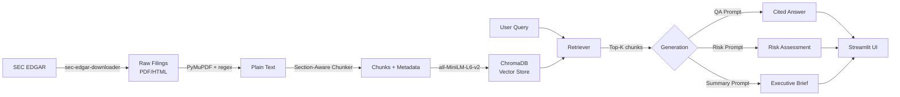

# Architecture

## System Overview

## Data Pipeline

1. **Download** — `sec-edgar-downloader` fetches 10-K filings from SEC EDGAR for target tickers
2. **Parse** — PyMuPDF extracts text from PDFs; regex strips HTML tags from .htm filings
3. **Chunk** — Section-aware splitter uses SEC section headers (Risk Factors, MD&A, etc.) to create semantically meaningful chunks with overlap
4. **Embed** — `all-MiniLM-L6-v2` (384-dim) encodes chunks into vectors
5. **Store** — ChromaDB persistent client stores vectors + metadata (company, filing type, section, date)

## Retrieval

- Cosine similarity search over ChromaDB
- Optional metadata filters: company, filing type
- Returns top-K chunks with relevance scores

## Generation

Three prompt templates, all fed retrieved context:

| Mode | Purpose | Output |
|---|---|---|
| QA Chain | Answer specific questions | Cited answer + sources + confidence |
| Risk Assessor | Identify red/amber/green flags | Categorized risk matrix |
| Executive Summary | 1-page due diligence brief | Structured report with recommendation |

## LLM Backend

Configurable via environment variables:
- **Ollama** (default): Local inference, no API key needed
- **HuggingFace Inference API**: Cloud fallback, free tier available
